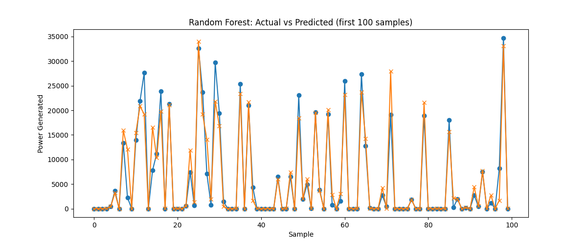

# Solar Power Output Prediction Using Weather Data 🌞

Hello! This project predicts solar power generation using historical weather data.  
By analyzing temperature, solar irradiance, and other weather factors, the goal is to estimate solar power output and understand how environmental conditions affect energy production.

This project was built as part of my hands-on Machine Learning journey, where I apply data cleaning, visualization, and regression modeling to real-world datasets.

---

## 🔑 What I Did
- Cleaned and preprocessed weather and solar power data to make it ready for analysis  
- Performed Exploratory Data Analysis (EDA) using histograms, KDE plots, boxplots, and correlation analysis  
- Built a regression model to predict solar power output  
- Evaluated predictions against actual values to measure performance  
- Visualized results for a clear understanding of how well the model works

---

## 🛠 Tech Stack & Skills Used
- **Languages & Libraries:** Python | Pandas | NumPy | Matplotlib | Seaborn | Scikit-learn | Jupyter Notebook  
- **Skills Practiced:** Data Cleaning | Exploratory Data Analysis (EDA) | Regression Modeling | Model Evaluation | Visualization

---

## 📊 Sample Output
Here’s an example of the model’s prediction compared to actual solar power output:  

  

*The plot shows how closely the predicted solar power matches the actual output.*

---

## 🚀 How to Run This Project
1. Clone the repository:  
```bash
git clone https://github.com/kamran15611-code/predicting-solar-output-using-weather-data.git
2. Open the notebook Solar_Power_Prediction.ipynb in Jupyter Notebook

3 . Run all cells to reproduce the analysis, plots, and predictions

